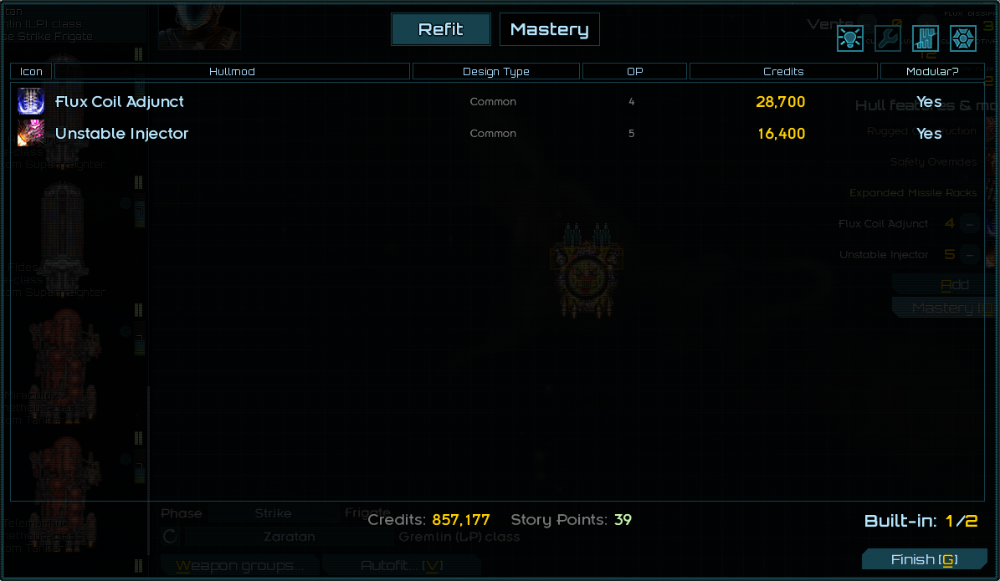
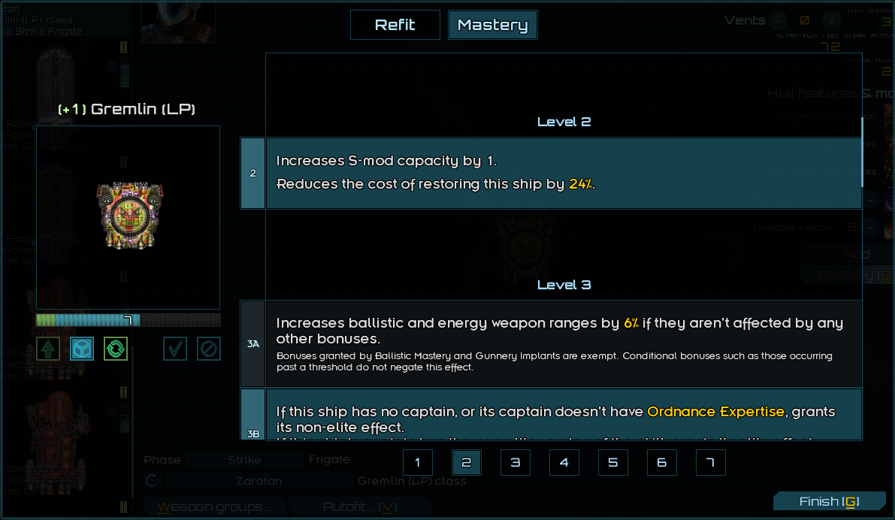

# Ship Mastery System
A Starsector mod that allows the player to gain mastery in ship hulls to unlock S-mod slots and additional bonuses.

## Ship Masteries

- Gain mastery points (MP) in a specific ship class randomly while gaining XP.
    - XP gained from combat has a chance to grant MP in combat ship classes in your fleet
    - XP gained from any other source has a chance to grant MP in civilian ship classes in your fleet
- MP can also be acquired by consuming knowledge constructs, which appear as rare loot under certain circumstances
- Use MP to build in hullmods or advance your mastery level in a specific ship class.
    - Each ship class has its own MP pool that is shared between all ships of that class.
    - Mastery level and mastery selections (for levels that have more than one option) are also shared between all ships of
      a ship class.
- Advancing your mastery of a ship class boosts its performance in a variety of ways. Some mastery levels have randomized
  bonuses, while others' are fixed.

## Revamped S-mod System

- All ships start with 0 S-mod capacity. Level up ship mastery to gain S-mod capacity.
- Each ship class has exactly 3 available S-mod capacity upgrades.
  - Best of the Best no longer increases S-mod capacity, 
    instead improving the effectiveness of most masteries and granting bonuses to capital ships with officers.
- Building in hullmods no longer costs story points, instead costing mastery points (MP) and credits.

## NPC Masteries

- NPC fleets follow the same general rules as player fleets, and may have mastery levels in some ship classes.
- Ships in an NPC fleet that have mastery effects applied will also have a marker hullmod added, so hovering over that
  ship will show its mastery level.
- Adds a post-inflation sequence to add S-mods to ships in generic NPC fleets, if they've unlocked mastery
  levels that grant them S-mod capacity.
- NPC fleets' mastery quality (and other related settings) can be changed in the difficulty subsection of the settings.